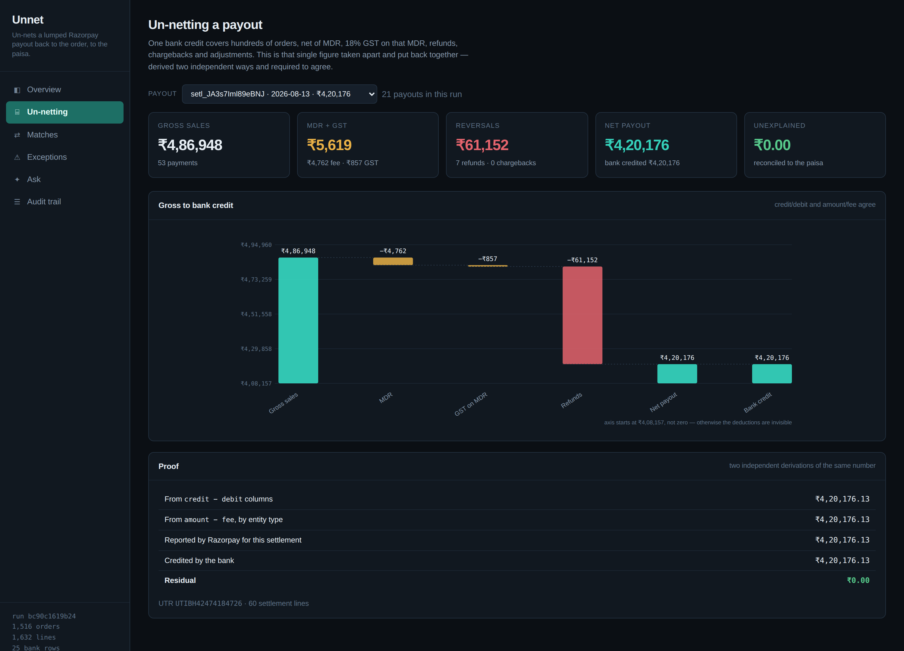

# Unnet

**Un-nets a lumped Razorpay payout back to the order, to the paisa.**

Razorpay AI Buildathon 2026 · **AI Finance Controller** track

---

## The problem

A Razorpay T+2 settlement arrives in a merchant's bank account as **one lumped
NEFT credit** covering hundreds of orders — net of MDR, 18% GST on that MDR,
refunds, chargebacks and adjustments. The merchant's own books have the gross
orders. Nothing links the two but a UTR buried in a bank narration string.

Every week, a finance person unpacks that by hand in a spreadsheet. Razorpay's
own 2026 merchant playbook names the two failure modes: **missing UTRs**, so
payouts cannot be matched to bank credits, and **unexplained deductions** that
finance cannot trace.

Unnet closes that loop. Three sources in — the merchant's ledger, Razorpay's
settlement recon report, the bank statement — and out comes a reconciled
position, a per-payout decomposition proving where every rupee went, and an
honest list of what could not be explained.

## What it does, in one screen



One bank credit of ₹4,20,176.13, taken apart: ₹4,86,948 of gross sales, less
₹4,762 MDR, less ₹857 GST on that MDR, less ₹61,152 of refunds. Derived two
independent ways from the settlement report, and both agree with the bank to the
paisa.

## Measured results

Scored against `data/synthetic/ground_truth.json`, **which the engine never
reads**. Full report in [`docs/METRICS.md`](docs/METRICS.md); regenerate with
`make ablation`.

| | Standard fixtures | 35% of gateway identifiers removed |
| --- | ---: | ---: |
| Records processed | 3,173 | 3,173 |
| Auto-match rate | 100.00% | 65.44% |
| **False-match rate** | **0.00%** | **0.19%** |
| Value reconciled | ₹1,54,80,906 (99.1%) | — |
| Wall clock | ~950 ms | ~1,200 ms |
| Throughput | ~3,300 records/sec | — |

The second column is the one worth reading. When a third of the identifiers
disappear, **recall falls by a third and precision does not move.** That is
deliberate: with no identifier, hundreds of small UPI orders share an amount and
a minute, and the honest answer is that we do not know which is which. Those go
to the exception queue. Picking the nearest and moving on would have produced a
much prettier match rate and a ledger nobody should trust.

Every one of the 12 injected defect classes is detected, on the right records,
with 100% recall and precision — see the per-code table in `docs/METRICS.md`.

## Where the AI is — and deliberately is not

The brief warns that forcing an LLM into a problem a rule solves better will be
marked down. That warning shaped this design, so it is worth being explicit.

**No model is involved in:** matching, any arithmetic, the netting proof, fee and
GST recomputation, or any write to the ledger. Reconciliation is an equality
problem over integers. A model is worse at that than `==` and cannot be audited.

**A model is used in three places, each gated:**

| Where | Why a rule cannot do it | What gates it |
| --- | --- | --- |
| **Schema mapping** | Every merchant names their ledger columns differently and every bank exports a different layout. The alias table handles what we have seen; it cannot be finished. | The proposed mapping is dry-run parsed against real rows and type-checked. A mapping that does not parse is discarded for the heuristic. |
| **Exception triage** | Explaining a residual sometimes needs a quantity in no table — a ₹10 NEFT charge plus GST. Search cannot find what it does not know to look for. | The components must sum to the residual **exactly, in integer paise**. Off by one paisa is rejected. |
| **Ask (NL→SQL)** | Open-ended questions over a schema. | Single `SELECT`, known tables only, read-only, row-capped. The SQL is shown next to the answer. |

And critically — **exact search runs before the model does.** The
consolidated-credit case (two payouts posted by the bank as one line) is closed
by bounded subset-sum, not by asking a model. If arithmetic can close an
exception, arithmetic closes it.

### The verifier

The single most important object in this repo is
[`unnet/agents/verifier.py`](unnet/agents/verifier.py). A model may *propose* a
decomposition. It may not *post* one.

A proposal is rejected if the components do not sum exactly, if it cites a
settlement that does not exist, if it cites one twice, if it claims money already
reconciled elsewhere, if it restates a real payout's amount to make the sum work,
or if it balances the books with an implausibly large unnamed "adjustment".

There is no tolerance. Fifty paise is nothing to a person skimming a summary and
everything to the books, and a decomposition that is ₹0.50 out is not a slightly
wrong answer — it is evidence the reasoning behind it was wrong.
`tests/test_verifier.py` is twelve adversarial proposals, each of which must be
refused.

## Running it

No API key, no network, no node. Python 3.11+.

```bash
git clone https://github.com/r11shi/razorpay-buildathon
cd razorpay-buildathon
make demo
```

That generates the fixtures, runs the reconciliation, regenerates the metrics,
and serves the dashboard on <http://127.0.0.1:8000>.

Individually:

```bash
make gen        # regenerate fixtures + held-out ground truth (fixed seed)
make recon      # one reconciliation run
make eval       # score against ground truth
make ablation   # rules-only vs rules+model, plus the robustness profile
make test       # 54 tests
make serve      # dashboard only
```

### Running the agents

The model layer defaults to `offline` — cassette replay only — so nothing here
touches the network unless you ask it to. To turn it on, copy `.env.example` to
`.env` and pick a provider:

```bash
# Local, no API key. Any OpenAI-compatible server:
#   llama.cpp   llama-server -m model.gguf --port 8080
#   Ollama      ollama serve            (port 11434)
UNNET_LLM_PROVIDER=local
UNNET_LOCAL_BASE_URL=http://localhost:8080/v1

# Or hosted, later — this is the only line that changes:
# UNNET_LLM_PROVIDER=gemini
# GEMINI_API_KEY=...
```

Then `make record` runs with the model and records its responses as cassettes,
so the run reproduces offline afterwards.

> **Honest status of the model layer.** The agents, the provider abstraction,
> the circuit breaker and the verifier are all built and tested, and the
> verifier's rejection paths are covered by unit tests. But the committed
> metrics were produced with **no model configured**, so the ablation's
> "rules + model" column currently equals the rules column and the run reports
> the AI layer as unexercised rather than pretending otherwise. Point it at a
> local llama.cpp server or a Gemini key and `make ablation` will fill that
> column in. Nothing in `docs/METRICS.md` is a model result that a model did not
> actually produce.

## Architecture

```
merchant_ledger.csv ─┐
settlement_recon.csv ─┼─▶ INGEST ──▶ MATCH ──▶ NETTING ──▶ RESOLVE ──▶ REPORT
bank_statement.csv  ─┘   schema      tiers 1-3  proof       subset-sum   dashboard
                         mapping     (rules)    (rules)     then model   + Ask
                         + narration                        + VERIFIER
```

1. **Ingest** — arbitrary CSVs onto one canonical schema mirroring Razorpay's own
   settlement-recon field names. A UTR is pulled out of the bank narration by
   regex; the model is asked only on a miss.
2. **Match** — three deterministic tiers. Bank credit ↔ payout (by UTR, then
   amount and date). Settlement line ↔ order (by id, then amount, method and
   time). Refund/chargeback ↔ the payment it reverses, across settlement cycles.
   Every fuzzy rule **requires a unique candidate and refuses otherwise.**
3. **Netting** — per payout, prove `gross − MDR − GST − refunds − chargebacks −
   adjustments = bank credit`, derived two independent ways and required to
   agree. MDR and GST are recomputed from a rate card so mis-billing surfaces
   instead of vanishing into the total.
4. **Resolve** — exact subset-sum on what is left; a model only after that.
5. **Report** — dashboard, append-only audit trail, Q&A.

Full detail in [`docs/ARCHITECTURE.md`](docs/ARCHITECTURE.md). The reasoning
behind each significant choice, including the ones I would revisit, is in
[`docs/DECISIONS.md`](docs/DECISIONS.md).

## The exception taxonomy

Sixteen ways a rupee fails to reconcile, each reported separately because they
need different actions:

`UNMATCHED_BANK_CREDIT` · `MISSING_BANK_CREDIT` · `SHORT_CREDIT` · `OVER_CREDIT` ·
`ORPHAN_SETTLEMENT_LINE` · `UNSETTLED_ORDER` · `ON_HOLD` · `FEE_MISMATCH` ·
`GST_MISMATCH` · `REFUND_WITHOUT_ORIGINAL` · `PARTIAL_REFUND_SPLIT` ·
`CHARGEBACK_DEDUCTION` · `DUPLICATE` · `TIMING_DIFFERENCE` · `ROUNDING` ·
`SCHEMA_UNPARSEABLE`

Two of those distinctions matter more than the rest:

- **`TIMING_DIFFERENCE` is not an error.** A payout initiated yesterday has not
  gone missing; NEFT has not landed yet. It is rolled into the next run rather
  than reported. Recon tools that cry wolf every morning are recon tools people
  learn to ignore.
- **`ROUNDING` is not a `SHORT_CREDIT`.** One paisa of drift is not a missing
  payment, and sending someone to hunt for one wastes an afternoon.

## Audit trail

Every decision is appended to `recon_audit`: what was decided, by which rule or
which model, with what confidence, on what evidence, and what the verifier made
of it. Model decisions carry a prompt hash, so the exact input that produced a
decision can be recovered — a model name alone is not reproducible.

Nothing can reach the output without also reaching the trail; both writers go
through the same two methods on `ReconContext`.

## The data

`data/synthetic/` is generated from a fixed seed, so `make gen` reproduces the
fixtures — and therefore the published metrics — byte for byte on any machine.
It contains 1,516 orders across 21 payouts, ~₹1.56 crore of gross sales, and 130
deliberately injected breaks covering all twelve realistic defect classes.

Defects are injected **by count, not by coin-flip**: over 21 payouts a 2%
per-batch probability routinely produces a fixture with zero instances of a
defect, and an exception the fixture never contains is one the metrics can never
exercise.

An optional adapter for Razorpay's live test-mode `settlements.fetch_recon`
endpoint is in [`unnet/ingest/razorpay_live.py`](unnet/ingest/razorpay_live.py) —
same canonical schema, so it drops straight in.

## Repo layout

```
unnet/
  core/        money.py (integer paise) · models.py · db.py (audit log)
  ingest/      mapping.py · loaders.py · narration.py · razorpay_live.py
  engine/      tier1.py · tier2.py · tier3.py · netting.py · pipeline.py
  agents/      verifier.py · resolvers.py · triage.py · mapper.py · qa.py
  llm/         provider.py · local.py · gemini.py · groq.py
  api/         main.py
  evaluation/  generator.py · score.py
  cli.py
web/index.html    the whole dashboard, no build step
docs/             ARCHITECTURE · DECISIONS · METRICS · FAILURES · PITCH
tests/            54 tests
```

## Licence

MIT.
